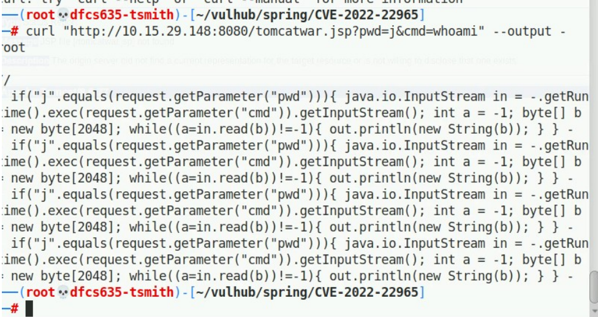

# Container Security: Spring4Shell (CVE-2022-22965) Verification

Reproduction and verification of CVE-2022-22965 ("Spring4Shell"), a critical (CVSS 9.8) remote code execution vulnerability in the Spring Framework, against Vulhub's pre-built vulnerable lab image.

> **Scope.** This exercise verifies exploitability of a known CVE against a purpose-built vulnerable image; it does not include building a Dockerfile from scratch, nor a working patched rebuild. See Limitations.

## Vulnerability

| Field | Value |
|---|---|
| CVE | CVE-2022-22965 |
| Name | Spring Framework RCE / "Spring4Shell" |
| CVSS | 9.8 (Critical) |
| Affected | Spring Framework on JDK 9+, via Tomcat's `ClassLoader` reachable through Spring's `DataBinder` |

## Environment

Vulhub's [`spring/CVE-2022-22965`](https://github.com/vulhub/vulhub) lab: a pre-built vulnerable Spring/Tomcat image started via Vulhub's own `docker-compose.yml`. **No Dockerfile was authored for this exercise** — the vulnerable image is Vulhub's, pulled and run as-is; there is no application source code included in the image, which is the reason the remediation step below is conceptual rather than tested (see Limitations).

## Tools

| Tool | Purpose |
|---|---|
| Docker / Docker Compose | Running Vulhub's pre-built vulnerable image |
| `curl` | Delivering the exploit payload and triggering the resulting webshell |
| Firefox | Confirming the target application was reachable before exploitation |

## Artifacts in this directory

| Path | Contents |
|---|---|
| [`scripts/spring4shell-exploit.sh`](./scripts/spring4shell-exploit.sh) | The full two-stage `curl` exploit chain, annotated |
| [`reports/BinderControllerAdvice.java`](./reports/BinderControllerAdvice.java) | Conceptual `WebDataBinder` remediation class (not built/tested) |
| [`reports/remediation-attempt.md`](./reports/remediation-attempt.md) | Why remediation stayed conceptual, and the lab's own (unverified) predicted post-fix output |
| `Images/` | Screenshots for each step — see [`Images/README.md`](./Images/README.md) |

## Methodology

Full command log: [`scripts/spring4shell-exploit.sh`](./scripts/spring4shell-exploit.sh).

1. **Stand up the target.** `docker-compose up -d` against Vulhub's `spring/CVE-2022-22965` directory, pulling the pre-built vulnerable image.
2. **Confirm reachability.** Verified the Spring app responded on `localhost:8080` before attempting exploitation.
3. **Stage 1 — config injection.** Sent a crafted `curl` request exploiting Spring's `DataBinder` to reach `class.module.classLoader`, overwriting the Tomcat access-log pattern, directory, prefix, and suffix so the next request's log line gets written to `webapps/ROOT/tomcatwar.jsp` as valid JSP. Custom `c1`/`c2`/`suffix` headers supply the JSP scriptlet delimiters (`<%` / `%>//`) and a `Runtime.exec()`-based command shell inside the log-pattern payload.
4. **Stage 2 — trigger the webshell.** Requested `tomcatwar.jsp?pwd=j&cmd=whoami`, executing the planted command shell.

## Findings

**RCE confirmed.** The `whoami` command returned `root` — the exploit chain achieves remote code execution as the container's highest-privileged user.

**Root cause.** Spring's `DataBinder` on JDK 9+ auto-binds HTTP request parameters to Java object properties without adequately restricting which properties can be reached. Because JDK 9 exposed new platform API surface, an attacker could walk the property path down to the live Tomcat `ClassLoader` and mutate its internal `AccessLogValve` configuration — overwriting where and how Tomcat writes its logs, and abusing that to write attacker-controlled JSP content directly into the public web root.

## Assessment

This is a full, verified remote-code-execution chain against an unauthenticated, unmodified vulnerable Spring/Tomcat deployment — achieved with two HTTP requests and no credentials. In a real deployment matching this configuration (Spring Framework on JDK 9+, default Tomcat logging setup, world-writable log path used for the exploit), this would constitute a critical, actively-exploitable finding warranting immediate patching or network isolation.

## Recommendations

- **Patch immediately.** Spring Framework 5.3.18 / 5.2.20 or later; Spring Boot 2.6.6 / 2.5.12 or later; Apache Tomcat 10.0.20 / 9.0.62 / 8.5.78 or later (these Tomcat versions close the specific vector used to write the webshell).
- **Defense in depth while patching is scheduled:** deploy a WAF rule blocking request parameters/bodies containing `class.module.classLoader`, `class.*`, or similar property-path patterns.
- **Application-level mitigation:** add a global `@ControllerAdvice` `WebDataBinder` denylist (see [`reports/BinderControllerAdvice.java`](./reports/BinderControllerAdvice.java)) blocking binding to `class.*`/`Class.*` properties — this is a compensating control, not a substitute for patching.
- **Detection:** alert on unexpected `.jsp` file writes into `webapps/ROOT` or equivalent web roots outside of deployment tooling, and on Tomcat access-log configuration changes outside of maintenance windows.

## Limitations

- No Dockerfile — vulnerable or hardened — was authored for this exercise. The vulnerable image came pre-built from Vulhub; there is no vulnerable Dockerfile to publish because none was written.
- The "hardened" side of this exercise is **conceptual and unverified**: [`BinderControllerAdvice.java`](./reports/BinderControllerAdvice.java) was written as the documented fix but never compiled, built into an image, or actually tested against the running exploit — there was no access to the application source needed to rebuild the image. The "expected" post-patch `400 Bad Request` response in [`reports/remediation-attempt.md`](./reports/remediation-attempt.md) is the lab author's own prediction, not an observed test result.
- Exploitation was performed against a deliberately vulnerable, pre-configured lab image on an isolated local network — not a production system.
