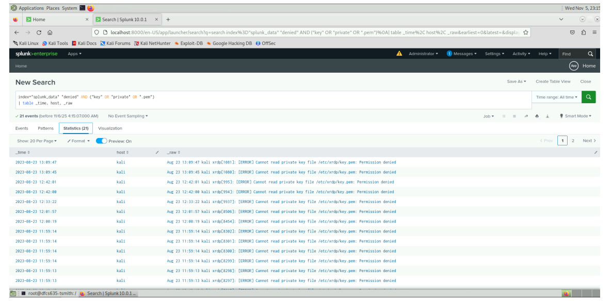
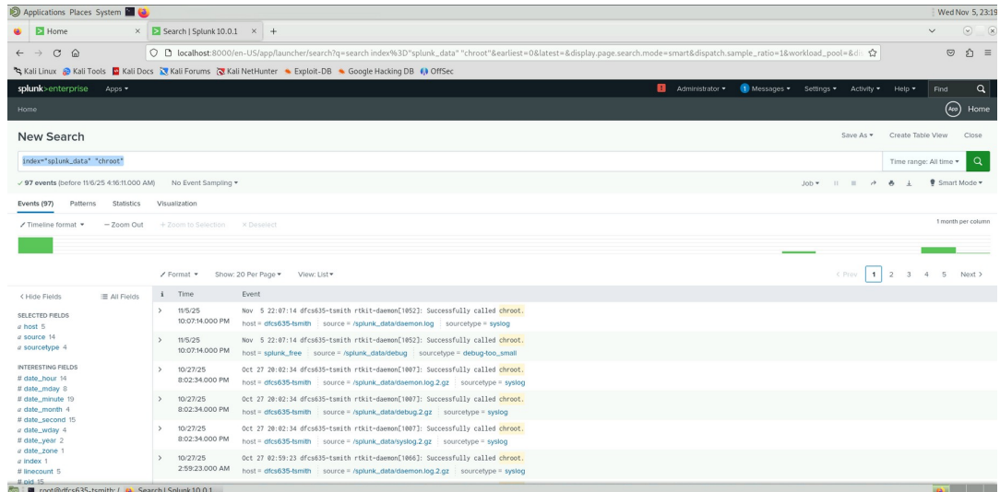
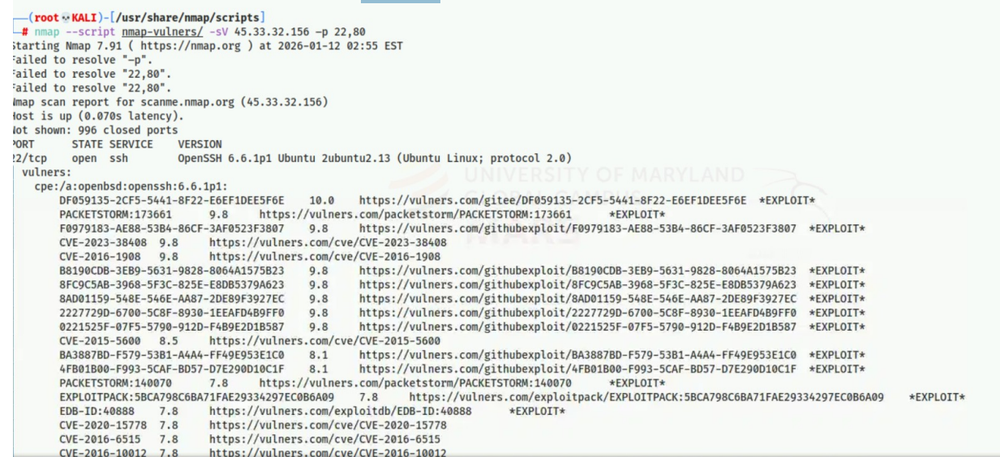

# SIEM Threat Hunting & Network Reconnaissance

Two exercises in defensive log analysis and incident response tooling: hypothesis-driven threat hunting across indexed log data using Splunk, and structured network reconnaissance using Nmap and the Nmap Scripting Engine.

> **Scope.** This directory covers SIEM log correlation and network reconnaissance. It does not include packet-level (PCAP) analysis or custom IDS/IPS rule development. Both exercises were performed in a controlled lab environment against a provided dataset and a sanctioned public test host.

## Tools

| Tool | Purpose |
|---|---|
| Splunk | Log ingestion, indexing, and query-based correlation |
| Nmap | Host discovery, port enumeration, OS fingerprinting |
| Nmap NSE (`vulners`) | Automated CVE cross-referencing against detected service versions |

## Contents

| Path | Contents |
|---|---|
| [`queries/`](./queries) | Five Splunk detection queries, each with hypothesis and tuning notes |
| [`scans/nmap-commands.md`](./scans/nmap-commands.md) | Annotated Nmap command log with rationale per scan type |
| `Images/` | Query output and terminal screenshots |

---

## Exercise 1 — Hypothesis-Driven Threat Hunting in Splunk

### Objective

Develop and validate detection queries against an indexed log dataset, targeting five distinct adversary behaviours: anomalous authentication timing, authentication failure clusters, post-exploitation tooling installation, credential theft, and container escape.

Each query begins from a stated hypothesis about attacker behaviour rather than from a tool feature. Individual queries with tuning notes are in [`queries/`](./queries).

### Detections developed

**1. Authentication outside business hours** — [`after-hours-logins.spl`](./queries/after-hours-logins.spl)

```spl
index="splunk_data" "login successful"
| eval hour=strftime(_time, "%H")
| where hour<9 OR hour>=18
| table _time, host, user
```

Legitimate activity clusters inside working hours (09:00–18:00). Successful authentication outside that window may indicate credential compromise, an operator in a different timezone, or insider activity.

**2. Failed authentication attempts** — [`failed-logins.spl`](./queries/failed-logins.spl)

```spl
index="splunk_data" "login failed" OR "failed login" OR "authentication failed"
```

Matches multiple string variants because authentication failure is logged differently across sources. Volume and concentration matter more than individual events — isolated failures are user error.



**3. Package installation activity** — [`apt-installs.spl`](./queries/apt-installs.spl)

```spl
index="splunk_data" "apt" AND "install"
```

Installing tooling is a routine post-exploitation step. This is a baselining query: its value is establishing what normal installation activity looks like so that deviations become visible.

**4. Denied access to private key material** — [`private-key-access.spl`](./queries/private-key-access.spl)

```spl
index="splunk_data" "denied" AND ("key" OR "private" OR ".pem")
| table _time, host, _raw
```

Denied reads against private keys have little benign explanation — a process that should read a key normally has permission to. Matches on denial plus key terms rather than a fixed path, since key material is not always stored where policy says it is.

**5. Container escape attempts** — [`chroot-attempts.spl`](./queries/chroot-attempts.spl)

```spl
index="splunk_data" "chroot"
```

In a containerised environment, `chroot` execution can indicate an attempt to break filesystem isolation. Combined with `CAP_SYS_CHROOT`, it is an escape primitive.



### Assessment

<!-- TODO — your input required. Do not let an assistant generate this.

     For each of the five detections, state:
       - roughly how many events returned, over what time window
       - whether results were genuine anomalies or expected background
         activity in a synthetic lab dataset

     If the dataset was lab-provided and these were baseline events rather
     than a real intrusion, say so plainly. That is more credible than
     implying you uncovered a live compromise, and it is what happened. -->

### Recommendations

<!-- TODO — write only what you would defend in an interview.

     Rough shape:
       - conditional access enforcing time-window restrictions
       - lockout thresholds and alerting on failure concentration
       - change-window enforcement for package installation
       - key material moved to a secrets manager, with read alerting
       - CAP_SYS_CHROOT dropped from container runtime capabilities

     Use 05-AI-Cybersecurity-NIST/README.md as the model — its Strategic
     Recommendations section is the right register and length. -->

### Detection engineering notes

Each query in [`queries/`](./queries) carries tuning notes covering expected false positive sources and suggested correlation with the other detections. The most useful pairing is authentication failures followed by a successful after-hours login on the same account — a stronger signal than either detection produces alone.

---

## Exercise 2 — Network Reconnaissance for IR Triage

> **Framing.** This was a structured lab exercise in tooling proficiency, not a live investigation. The target was `45.33.32.156` (`scanme.nmap.org`), a host the Nmap project provides for scanning practice. No production or third-party system was scanned, and no incident was in progress.

### Objective

Build working proficiency with Nmap and NSE as applied to incident response triage: establishing whether a host is reachable, enumerating exposed services, inferring the operating system, and cross-referencing detected versions against known vulnerabilities.

### Methodology

Full annotated command log: [`scans/nmap-commands.md`](./scans/nmap-commands.md)

```bash
nmap -sn 45.33.32.156              # host discovery, no port scan
nmap -sS 45.33.32.156              # stealth SYN — half-open, lighter log footprint
nmap -O -vv 45.33.32.156           # OS fingerprinting, verbose reasoning
nmap --script=default 45.33.32.156 # default NSE script set
nmap --script vulners 45.33.32.156 # CVE cross-reference on detected versions
```

Scan selection reasoning and per-technique limitations are documented in the command log. Two points worth surfacing here:

**`-sS` over `-sT`.** A half-open scan never completes the TCP handshake, leaving less behind in application-level connection logs. When triaging a host that may be monitored or under attacker control, minimising your own footprint matters — and it avoids contaminating logs you may need to analyse later.

**`vulners` output is a lead, not a finding.** The script matches on reported version strings. It does not verify exploitability and does not account for backported vendor patches, so it will report CVEs against versions already remediated. Treating its output as confirmed vulnerabilities is a common and consequential analyst error.

### Output



<!-- TODO — your input required.

     Read your own vulners_terminal_output.png and document what it shows:
     which ports were open, which service versions were detected, which
     CVEs the script returned and at what severity.

     The source lab captured screenshots but recorded no written findings,
     so this must come from reading your own output. Do not let an
     assistant infer plausible-sounding results. -->

### Reflection

<!-- TODO — the source lab included seven written reflection questions on
     Nmap's role in incident response. Condense your two or three strongest
     points into a short paragraph. Cite Lyon (2010) and Robert (2025). -->

---

## Limitations

- No packet-level (PCAP) analysis was performed.
- No custom IDS/IPS rules were developed.
- No host-based forensic collection was performed on the scanned target.
- Scanning was point-in-time and uncredentialed.
- The Splunk dataset was lab-provided rather than drawn from a live environment.

## Sources

- Lyon, G. (2010). *Nmap network scanning: Official Nmap project guide to network discovery and security scanning.* Insecure.Com.
- Robert, A. (2025, October 16). *Nmap incident response.* hoop.dev
