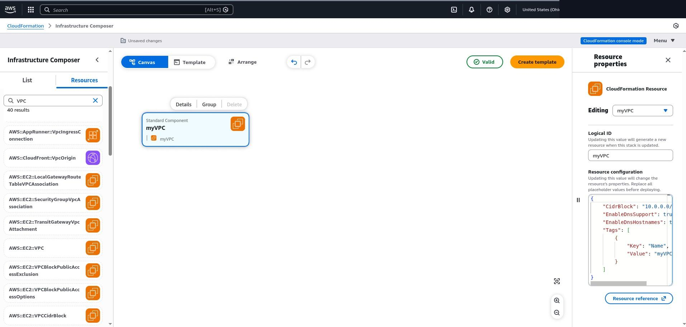
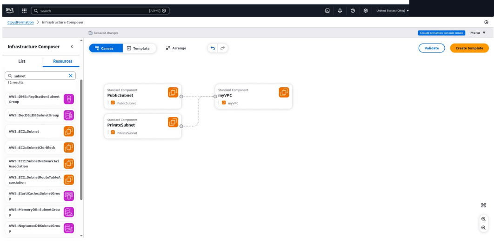
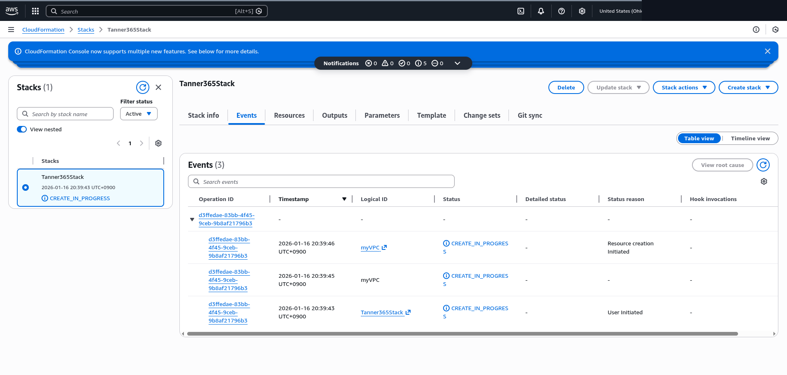
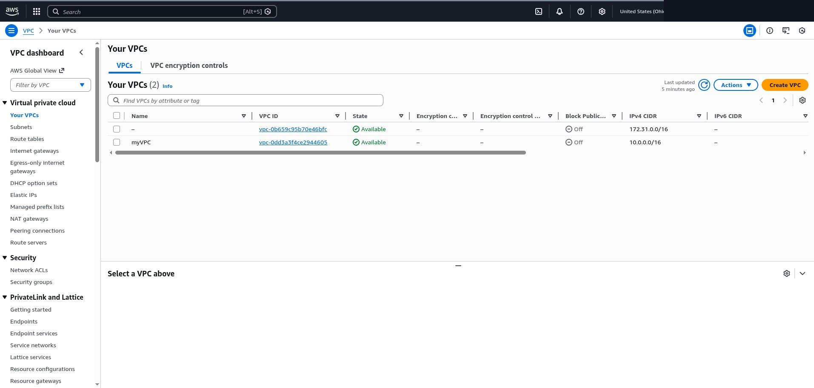
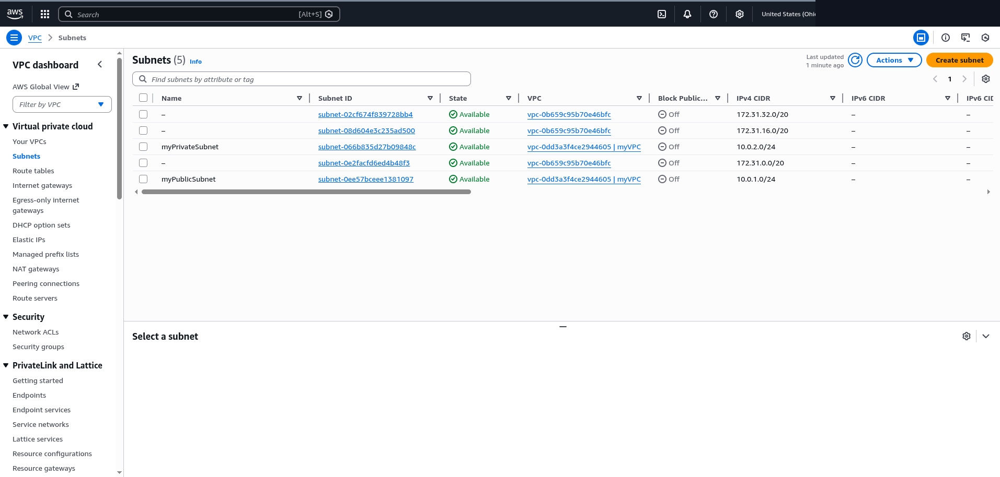

# Cloud Network Provisioning via Infrastructure as Code

A lab exercise in provisioning AWS network infrastructure through CloudFormation, using Infrastructure Composer's visual editor to author resource JSON rather than hand-writing a full template from scratch.

> **Scope.** This directory covers VPC and subnet provisioning only. It does not include an Internet Gateway, route tables, NAT gateway, security groups, or EC2 instances — none of those were part of this exercise, so "public" and "private" below are resource *names* the lab assigned, not a claim that the subnets have differentiated routing yet.

## Environment

CLCS 635 coursework lab, AWS Console (`us-east-2`, Ohio), student AWS Academy/Learner Lab account. Provisioning was done through the CloudFormation **Infrastructure Composer** tool — a drag-and-drop canvas that generates the underlying CloudFormation JSON as resources are added and their properties edited.

## Tools

| Tool | Purpose |
|---|---|
| AWS CloudFormation | Stack deployment and resource tracking |
| AWS Infrastructure Composer | Visual authoring of the CloudFormation template / resource JSON |
| Amazon VPC | Network isolation — VPC and subnet resources |
| Amazon S3 | Backing bucket created by CloudFormation for the stack's template artifact |

## Artifacts in this directory

| Path | Contents |
|---|---|
| [`templates/vpc-network-stack.json`](./templates/vpc-network-stack.json) | Reconstructed CloudFormation template — see note below |
| `Images/` | Console screenshots of the Composer canvas, stack events, and post-deploy verification |

> **Provenance note on the template file.** Infrastructure Composer auto-generates a full template as resources are added, but the source lab writeup only captured the per-resource JSON shown in each resource's "Resource properties" panel (the `myVPC`, `PublicSubnet`, and `PrivateSubnet` property blocks below) — not an export of the complete generated template. `templates/vpc-network-stack.json` wraps those exact, documented property blocks in the standard CloudFormation envelope (`AWSTemplateFormatVersion` + `Resources`, with each resource's `Type` taken from what the lab writeup states was selected in Composer) so the file is valid and deployable. No resource, property, or value beyond what's shown in the screenshots and lab document was added.
>
> **TODO (Tanner):** if you still have access to the AWS Academy lab account, or exported the template via Infrastructure Composer's "Create template" button at the time, pull the actual generated `template.json`/`.yaml` and swap it in here — it would be the authoritative artifact rather than a reconstruction.

## Methodology

Five steps, walked through in Infrastructure Composer against the CloudFormation console:

**1. Explore the CloudFormation dashboard and Infrastructure Composer tool.**

**2. Add a VPC to the Composer diagram** — resource type `AWS::EC2::VPC`, logical ID `myVPC`:

```json
"CidrBlock": "10.0.0.0/16",
"EnableDnsSupport": true,
"EnableDnsHostnames": true,
"Tags": [{ "Key": "Name", "Value": "myVPC" }]
```



**3. Add two subnets, type `AWS::EC2::Subnet`, both in `us-east-2a`:**

```json
// PublicSubnet
"VpcId": { "Ref": "myVPC" },
"CidrBlock": "10.0.1.0/24",
"AvailabilityZone": "us-east-2a",
"Tags": [{ "Key": "Name", "Value": "myPublicSubnet" }]

// PrivateSubnet
"VpcId": { "Ref": "myVPC" },
"CidrBlock": "10.0.2.0/24",
"AvailabilityZone": "us-east-2a",
"Tags": [{ "Key": "Name", "Value": "myPrivateSubnet" }]
```



**4. Create the CloudFormation template from the canvas and deploy the stack** (`Tanner365Stack`). Deployment created a backing S3 bucket for the stack's template artifact in addition to the VPC and subnet resources.



**5. Verify provisioning in the VPC console** — confirmed both the VPC and both subnets reached an `Available` state.




## Findings

- `myVPC` (`10.0.0.0/16`) provisioned successfully with DNS support and DNS hostnames enabled, confirmed `Available` in the VPC console.
- `myPublicSubnet` (`10.0.1.0/24`) and `myPrivateSubnet` (`10.0.2.0/24`) both provisioned inside `myVPC` in `us-east-2a`, both confirmed `Available`.
- The CloudFormation stack events screenshot captured `myVPC`'s creation at `CREATE_IN_PROGRESS`, not `CREATE_COMPLETE` — the stack was still mid-deployment at the moment that screenshot was taken. Successful provisioning is established by the subsequent VPC-console screenshots, not by the events screenshot.
- One authoring error was encountered and resolved during the lab: a JSON indentation mistake in the public subnet's resource properties broke its connection to the VPC in the Composer canvas. Infrastructure Composer's built-in validation surfaced it before deployment.

## Assessment

This demonstrates the mechanics of template-driven provisioning — editing declarative resource JSON, letting CloudFormation manage stack state and dependency ordering (`Ref` linking the subnets to the VPC), and verifying the result independently of the tool that created it — rather than clicking through the VPC wizard by hand.

It does **not** demonstrate a secure or production-ready network design. As provisioned, there is no Internet Gateway, no route table, no NAT gateway, and no security group — so despite the naming, neither subnet has internet egress or differentiated routing yet, and there's no enforced isolation between them beyond being separate CIDR blocks in the same VPC.

## Recommendations

If this were carried further toward a real deployment:

- Attach an Internet Gateway and a public route table to `myPublicSubnet` (`0.0.0.0/0` → IGW); keep `myPrivateSubnet` on a route table with no direct internet route.
- Add a NAT Gateway in the public subnet if the private subnet needs outbound-only internet access (e.g., for patching).
- Define security groups and NACLs scoped to actual workload requirements instead of relying on the VPC/subnet boundary alone.
- Move from a hand-edited Composer template to a version-controlled IaC pipeline (CloudFormation via CI/CD, or a Terraform equivalent) with a `cfn-lint`/`cfn_nag`-style static check before deploy.

## Limitations

- Single-AZ (`us-east-2a`) — no cross-AZ redundancy.
- No compute, routing, or security resources beyond the VPC and two subnets.
- Lab/training AWS account, not a production environment.
- The full auto-generated CloudFormation template was not exported from the lab session; `templates/vpc-network-stack.json` is a reconstruction from documented resource properties (see provenance note above), not a direct export.

## Sources

Lab writeup: *Unit 5: Provisioning Network Infrastructure in the Cloud* (course lab, dated in the writeup as Jan 17, 2026).
